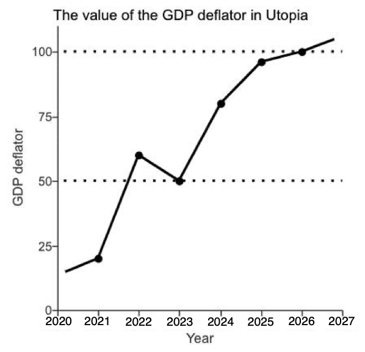

# GDP Deflator Explained Simply

The GDP deflator is a measure that shows how much prices in the overall economy have changed over time.

## What it is:
- A price index that tells us how much the average price level in the economy has increased (inflation) or decreased (deflation)
- Shows the difference between nominal GDP (current prices) and real GDP (adjusted for inflation)

## Simple formula:
```
GDP Deflator = (Nominal GDP ÷ Real GDP) × 100
```

## Example:
If nominal GDP is $200 billion and real GDP is $180 billion:
- GDP Deflator = ($200 billion ÷ $180 billion) × 100 = 111.1
- This means prices have increased by about 11.1% since the base year

## Why it matters:
- Helps us understand how much of economic growth is just due to rising prices
- Allows economists to measure "true" economic growth by removing the effects of inflation
- Used by governments and central banks to make economic policy decisions

Unlike CPI (Consumer Price Index), the GDP deflator includes ALL goods and services produced in the economy, not just a specific basket of consumer goods.


## The base Deflator in the graph is always at 100, so here:

Consider the adjacent graph depicting the value of the GDP deflator in Utopia from 2020 to 2026. The base year considered in the given data is 2026





