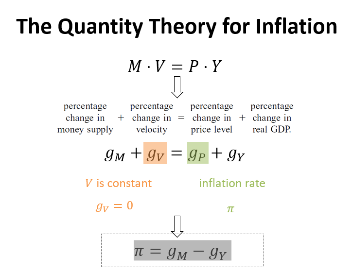

# Quantity Theory of Inflation

## Core Equations

### Basic Equation
π = g_M - g_Y

Where:
- π = Inflation rate
- g_M = Growth rate of money supply
- g_Y = Growth rate of real output (GDP)

### Extended Equation
g_M + g_V = g_P + g_Y

Where:
- g_M = Growth rate of money supply
- g_V = Growth rate of velocity
- g_P = Growth rate of price level
- g_Y = Growth rate of real output

### Example Calculations
```
Case 1: Assuming constant velocity (g_V = 0)
If g_M = 7% and g_Y = 3%
Then π = g_M - g_Y = 7% - 3% = 4%

Case 2: With changing velocity
If g_M = 5%, g_V = 2%, and g_Y = 3%
Then g_P = g_M + g_V - g_Y = 5% + 2% - 3% = 4%
```

## Key Relationships

### 1. Direct Money-Price Relationship
- Excess money growth causes inflation
- Example:
  ```
  Money supply doubles (100% increase)
  Real GDP grows 5%
  Expected inflation ≈ 95%
  ```

### 2. Real Output Adjustment
- Growth in real output reduces inflationary pressure
- Example:
  ```
  Money supply grows 10%
  If: Real GDP grows 0% → Inflation ≈ 10%
  If: Real GDP grows 4% → Inflation ≈ 6%
  ```

## Historical Examples

### 1. Hyperinflation Cases
- **Germany (1923)**
  ```
  Money supply growth: Over 1,000% per month
  Result: Prices doubled every few days
  ```
- **Zimbabwe (2008)**
  ```
  Money supply growth: Millions of percent
  Result: Prices doubled every day
  ```

### 2. Stable Price Era
- **U.S. (1990s)**
  ```
  Money supply growth: ~5-6% annually
  Real GDP growth: ~3-4%
  Result: Low inflation (~2-3%)
  ```

## Policy Implications

### 1. Monetary Control
- Central banks can control inflation through money supply
- Target: Money growth ≈ Real GDP growth + Desired inflation

### 2. Long-run Planning
```
If central bank wants:
- 2% inflation target
- Expected real GDP growth = 3%
Then should target:
Money supply growth = 5% (2% + 3%)
```

## Common Misconceptions

1. **"Printing Money Always Causes High Inflation"**
   - Reality: Depends on:
     - Rate of money growth vs. GDP growth
     - Velocity stability
     - Economic capacity

2. **"Inflation Is Only About Money Supply"**
   - Reality: Must consider:
     - Real GDP growth
     - Velocity changes
     - Structural changes in economy

## Modern Applications

### 1. Digital Money Era
- Electronic payments affect velocity
- Cryptocurrency impacts:
  ```
  Traditional QTM: M × V = P × Y
  Crypto addition: (M + C) × V = P × Y
  Where C = Cryptocurrency in circulation
  ```

### 2. Policy Challenges
- Measuring relevant money supply
- Managing multiple forms of money
- Controlling digital money growth

## Key Takeaways

1. **Inflation Formula**
   ```
   π ≈ %ΔM - %ΔY
   Where:
   π = Inflation rate
   %ΔM = Money growth rate
   %ΔY = Real GDP growth rate
   ```

2. **Policy Guidelines**
   - Money growth > GDP growth → Inflation
   - Money growth < GDP growth → Deflation
   - Money growth = GDP growth → Price stability

3. **Practical Use**
   - Long-run inflation forecasting
   - Monetary policy planning
   - Understanding hyperinflation causes
